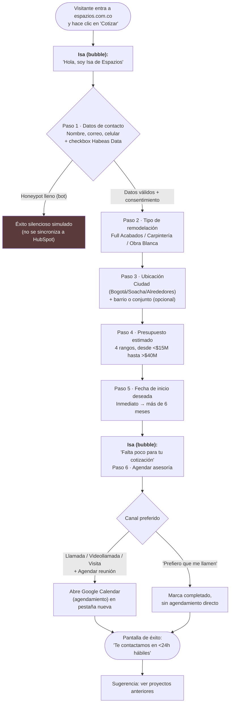
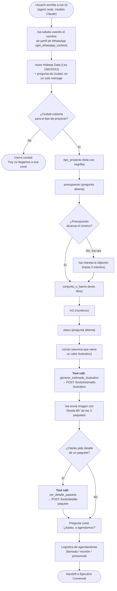
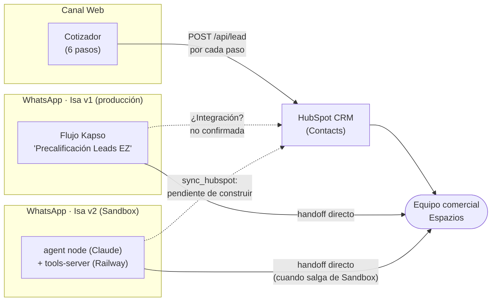

# Diagramas funcionales — Isa

Vista de negocio: qué le pasa al usuario en cada paso, sin entrar en detalle
de implementación (eso está en [`02-arquitectura-tecnica.md`](./02-arquitectura-tecnica.md)).

## 1. Canal web — Cotizador (`/#cotizador`)

Wizard de 6 pasos. Cada paso se guarda de inmediato ("Guardado ✓") y se
sincroniza a HubSpot en cuanto hay correo y consentimiento — no solo al final.

**Cada paso** (1 a 6) dispara `syncToHubSpot(etapa)` — es decir, el equipo
comercial ve el lead avanzar en HubSpot en tiempo casi real, incluso si el
visitante abandona el formulario a mitad de camino.

## 2. Canal WhatsApp — Isa (flujo Kapso "Precalificación Leads EZ")

Flujo observado en producción: entrada típica por un anuncio de Meta
(*click-to-WhatsApp*) con `referral` de Facebook/Instagram, aunque también
responde a mensajes directos al número `+57 310 8708467`.

**Nota:** el flujo usa **listas y botones interactivos de WhatsApp** para casi
todos los campos (menos nombre y barrio, que son texto libre) — esto reduce
errores de captura y facilita el mapeo a las mismas categorías que usa el
cotizador web (mismos rangos de presupuesto, mismas ciudades de cobertura,
mismos tipos de proyecto).

## 3. Isa v2 — agente generativo (Sandbox, `espazios-whatsapp-agent`)

Versión en desarrollo, probada en el Sandbox de Kapso al momento de esta
revisión (2026-08-24) — **no ha reemplazado** al flujo v1 de la sección 2. En
vez de un árbol de decisión fijo, un `agent node` con modelo Claude conduce
la conversación libremente siguiendo un system prompt (`docs/isa-v2-system-prompt.md`,
779 líneas) que igual debe recolectar los mismos 8 datos, en el mismo orden:
`nombre → ciudad → tipo_proyecto → presupuesto → conjunto_o_barrio → m2 → plazo → correo`.

Reglas de negocio explícitas en el repo que valen la pena resaltar:
- **La cotización nunca la redacta el modelo en texto libre** — siempre sale
  de fórmulas ya calculadas (Sheets/plantilla), el LLM solo la explica.
  Esto limita el riesgo de que el modelo "invente" un precio.
- El envío de fotos/videos del apartamento se reconoce y se guarda como
  contexto para el Ejecutivo Comercial, pero Isa tiene instrucción explícita
  de **no leer medidas ni datos como confirmados** a partir de una imagen.
- El "estimado ilustrativo" (imagen con 3 paquetes) es la funcionalidad que
  sí está conectada hoy; `generar_cotizacion` (PDF vía plantilla operativa
  del cotizador, `src/tools/cotizador/`) existe en el código pero está
  **dormida** — no forma parte del guion de conversación actual (ver
  hallazgo de inyección de fórmulas en
  [`03-analisis-seguridad.md`](./03-analisis-seguridad.md)).

## 4. Embudo unificado de leads

Los tres sistemas alimentan la misma intención de negocio (precalificar y
agendar una asesoría), pero **no hay evidencia, en el código ni en la
configuración revisada, de que ninguno de los dos canales de WhatsApp
escriba al mismo HubSpot que usa el cotizador web** — de hecho, el propio
`CLAUDE.md` de `espazios-whatsapp-agent` confirma esto explícitamente:
`sync_hubspot: falta construir`. Ver hallazgo de gobierno de datos en
[`03-analisis-seguridad.md`](./03-analisis-seguridad.md#hallazgo-info-1--sin-integración-visible-whatsapp--hubspot).

