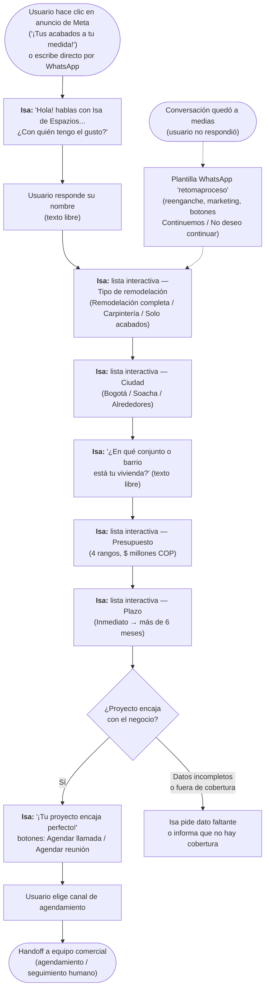
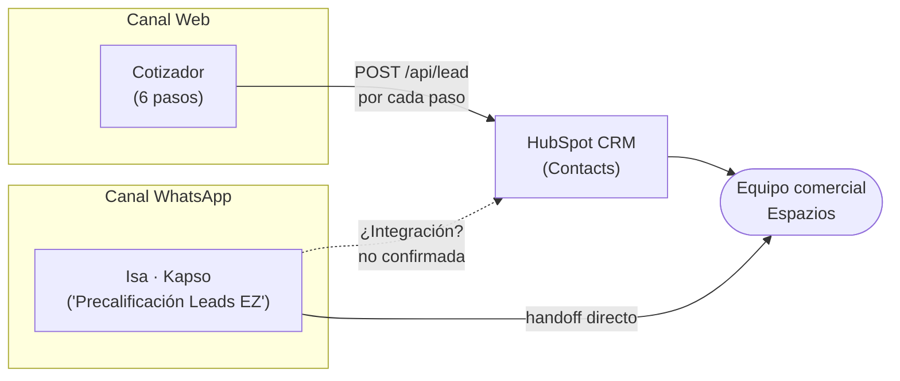

# Diagramas funcionales — Isa

Vista de negocio: qué le pasa al usuario en cada paso, sin entrar en detalle
de implementación (eso está en [`02-arquitectura-tecnica.md`](./02-arquitectura-tecnica.md)).

## 1. Canal web — Cotizador (`/#cotizador`)

Wizard de 6 pasos. Cada paso se guarda de inmediato ("Guardado ✓") y se
sincroniza a HubSpot en cuanto hay correo y consentimiento — no solo al final.

**Cada paso** (1 a 6) dispara `syncToHubSpot(etapa)` — es decir, el equipo
comercial ve el lead avanzar en HubSpot en tiempo casi real, incluso si el
visitante abandona el formulario a mitad de camino.

## 2. Canal WhatsApp — Isa (flujo Kapso "Precalificación Leads EZ")

Flujo observado en producción: entrada típica por un anuncio de Meta
(*click-to-WhatsApp*) con `referral` de Facebook/Instagram, aunque también
responde a mensajes directos al número `+57 310 8708467`.

**Nota:** el flujo usa **listas y botones interactivos de WhatsApp** para casi
todos los campos (menos nombre y barrio, que son texto libre) — esto reduce
errores de captura y facilita el mapeo a las mismas categorías que usa el
cotizador web (mismos rangos de presupuesto, mismas ciudades de cobertura,
mismos tipos de proyecto).

## 3. Embudo unificado de leads

Ambos canales alimentan la misma intención de negocio (precalificar y agendar
una asesoría), pero **no hay evidencia, en el código o la configuración
revisada, de que el canal WhatsApp escriba al mismo HubSpot que usa el
cotizador web** — ver hallazgo de gobierno de datos en
[`03-analisis-seguridad.md`](./03-analisis-seguridad.md#hallazgo-info-1--sin-integración-visible-whatsapp--hubspot).

