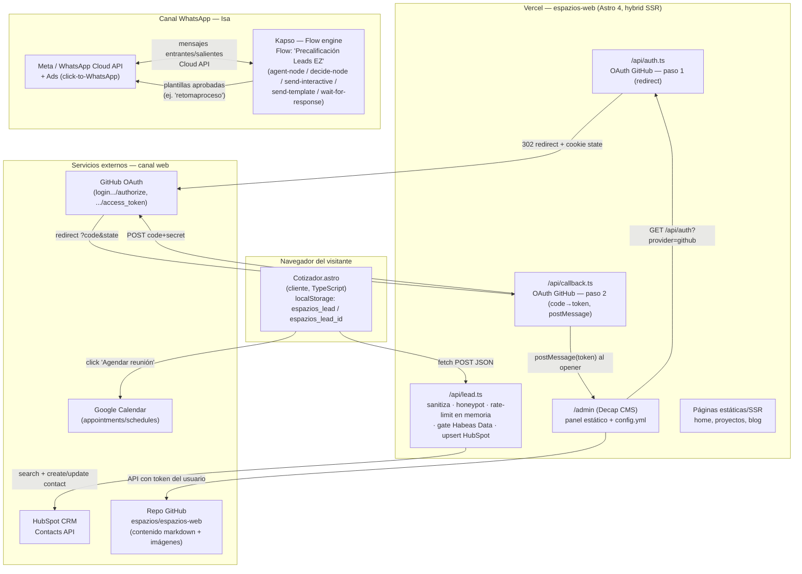
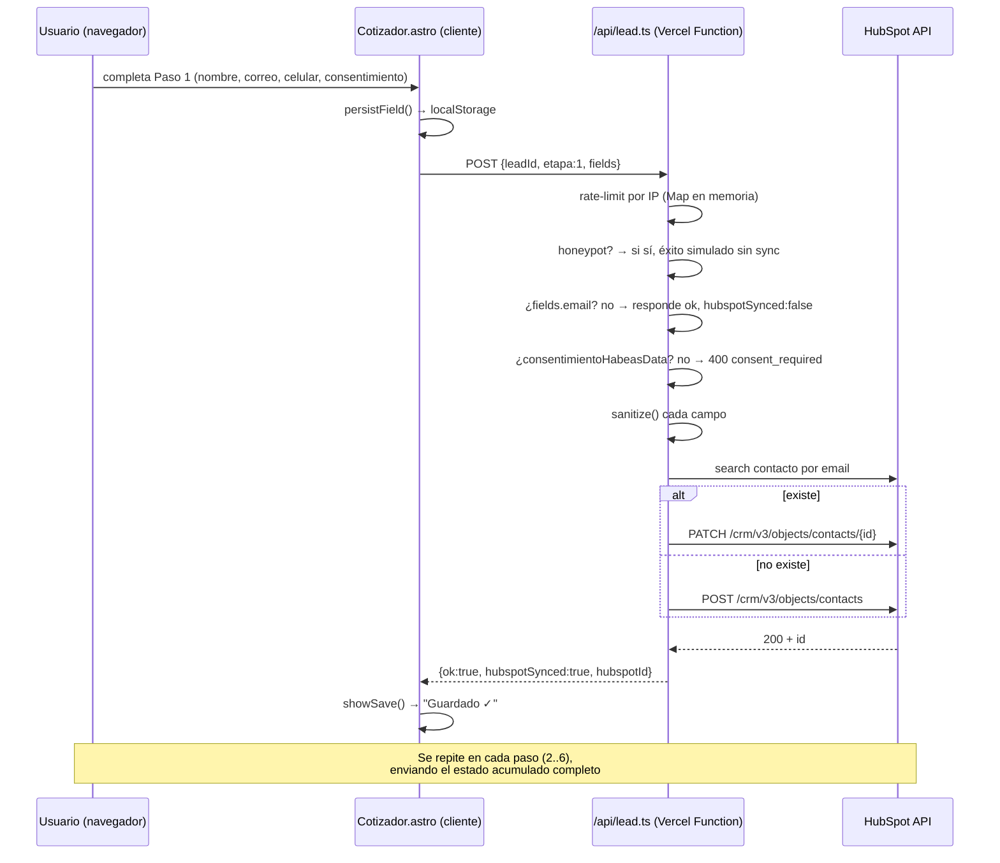
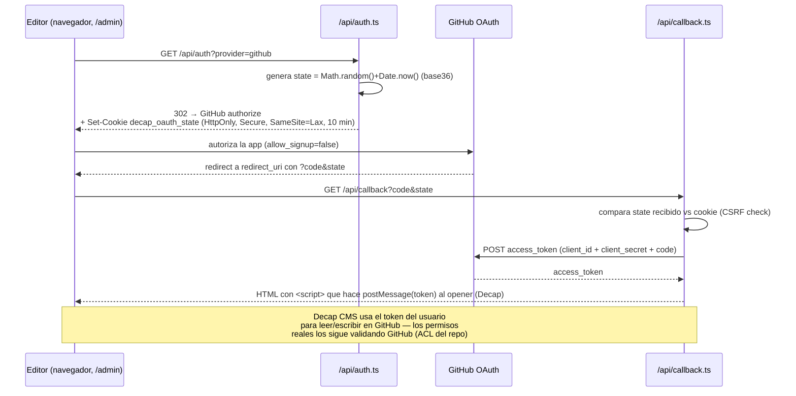
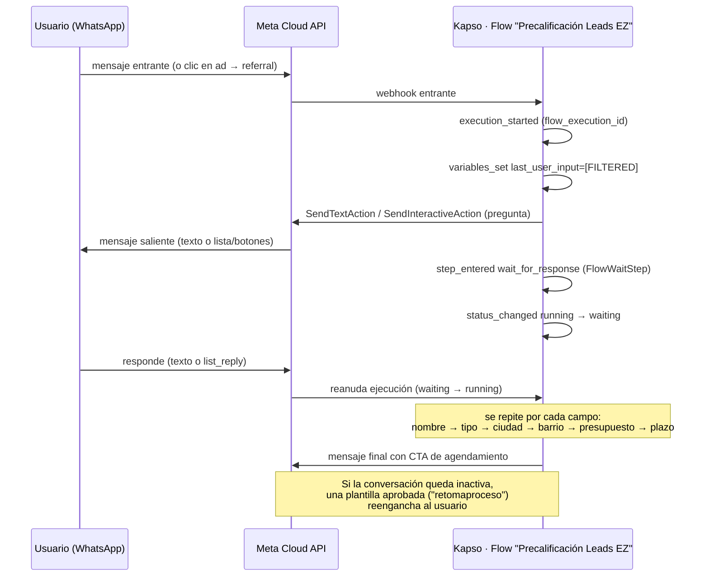

# Arquitectura técnica — Isa

## 1. Componentes y despliegue

## 2. Secuencia — sincronización progresiva del cotizador

## 3. Secuencia — OAuth de Decap CMS (`/admin`)

`redirect_uri` en `/api/auth.ts` se calcula como
`` `${url.protocol}//${url.host}/api/callback` `` — es decir, **se deriva del
host de la petición entrante**, no de una constante fijada al dominio de
producción. Ver hallazgo correspondiente en el análisis de seguridad.

## 4. Secuencia — Isa en WhatsApp (observada vía logs del flujo Kapso)

**Observación positiva:** los eventos de log del flujo (`variables_set`)
muestran el valor del último input del usuario como `[FILTERED]` — Kapso
redacta el contenido capturado por variables en sus logs de auditoría, lo
cual reduce la exposición de PII en la capa de observabilidad.

## 5. Mapa de datos personales (PII)

| Dato | Origen | Dónde se captura | Dónde se sincroniza/almacena | Consentimiento explícito |
|---|---|---|---|---|
| Nombre completo | Web + WhatsApp | Cotizador paso 1 / Isa WhatsApp | localStorage (navegador) → HubSpot | Sí (checkbox Habeas Data, solo canal web) |
| Correo electrónico | Web + WhatsApp | Cotizador paso 1 / Isa WhatsApp | localStorage → HubSpot | Sí (web) / no verificado (WhatsApp) |
| Celular / WhatsApp | Web (input) / WhatsApp (número de origen) | Cotizador paso 1 / metadata de conversación | localStorage → HubSpot / Kapso (conversación) | Sí (web) / no verificado (WhatsApp) |
| Ciudad, barrio/conjunto | Web + WhatsApp | Pasos 3 | localStorage → HubSpot / Kapso | Igual que arriba |
| Presupuesto estimado | Web + WhatsApp | Pasos 4 | localStorage → HubSpot / Kapso | Igual que arriba |
| Plazo / tiempo de inicio | Web + WhatsApp | Pasos 5 | localStorage → HubSpot / Kapso | Igual que arriba |
| Nombre público de contacto (WhatsApp) | WhatsApp | Perfil del contacto | Kapso (`whatsapp_conversations`) | N/A (metadata de la plataforma) |
| `ctwa_clid`, creative/anuncio de origen | WhatsApp (referral de Meta Ads) | Primer mensaje | Kapso (evento `referral`) | N/A (atribución de marketing) |

`leadId` en el canal web es un UUID v4 generado **en el cliente** con
`Math.random()` (no `crypto.randomUUID()`), almacenado en `localStorage`, y
viaja sin autenticación en cada `POST /api/lead` — cualquiera que lo conozca
podría, en teoría, reenviar/actualizar ese lead (ver análisis de seguridad).
